<!-- Vergeet je niet de comments uit te zetten voordat je begint met typen? 💬 -->

# Procesverslag

## Over
* **Naam:** Jorn Meessen 
* **Klas:** vid-2
* **Minor:** Visual Interface Design
* **Favoriete dier:** Panda's :panda_face:
* **Startniveau:** rood

## Websitelink
https://jornmeessen.github.io/generative-art-jornmeessen/schilderijen/
* De website werkt het beste op chrome.

**Videoboodschap**

## Concept

Letterlijk een digitaal kunstwerk. Met een witte paspartoe om het werk heen en een naambordje, net of het in een museum hangt.
Het schilderij wordt gemaakt uit ronden lijnen. Die lijken op de lijnen die van Gogh gebruikt in zijn werk. Er zullen meerderder lijnen tegelijk te zien zijn.

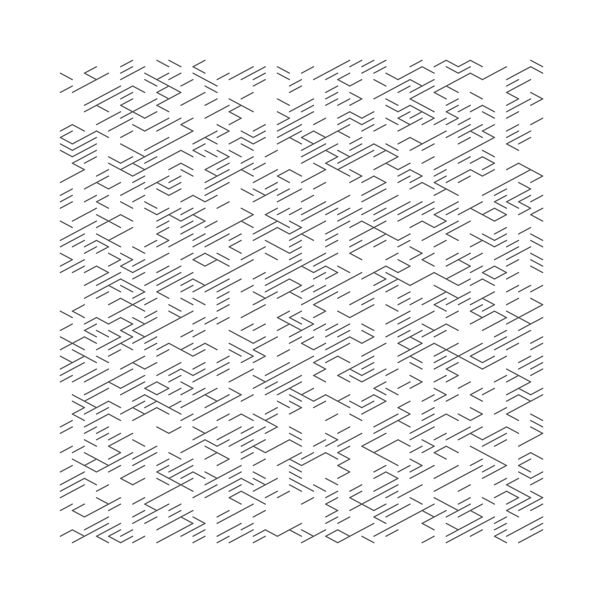
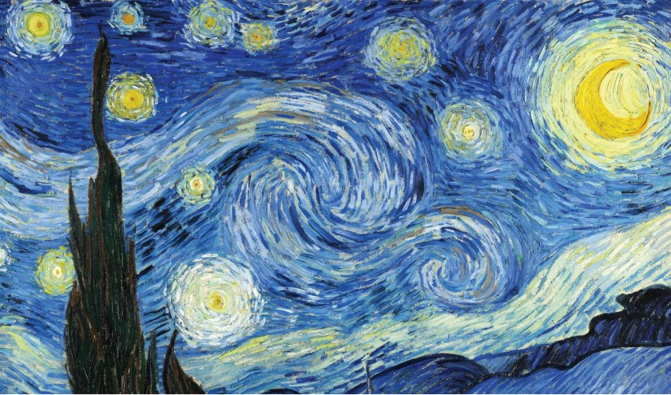

Dit schilderij zal live gemaakt worden en als het 'af' is gaat het over in een nieuw werk. Er is altijd beweging in het beeld te zien binnen de kaders. 

Wie ben ik, waar sta ik voor en wat wil ik:
-	Clean, netjes & geordend 
-	Uitdagend & creatief
-	Variatie 
-	Je moet betoverd worden

## Features

Je start het project in een meseum waar vanuit een database, random drie Van Gogh schilderijen worden getoond. Wanneer je de pagina ververst komen er drie nieuwe schilderijen in te staan. Ik heb het zo codereerd dat er nooit 2 dezelfde schilderijen tegelijk te zien zijn. Je kunt op de middelste schilderij klikken om zelf een schilderij in de stijl van Van Gogh te maken. 

Er wordt een nieuwe pagina geopend waarin een canvas van een schilderij te zijn is waarin genariek gekleurde lijnen te zien zijn. Wanneer je de pagina ververst wordt er een ander patroon gemaakt en de kleur veranderd ook. Je kunt ook het schilderij zelf aanpassen dit doe je door voice comments te gebruiken. De microfoon staat al standaard aan. Mocht de microfoon niet werken dan kan je ook de toetsen van je toetsenbord gebruiken, maar via de stem is leuker ;).

Op de volgende commando's reageert het systeem. Alle commando's zijn ook zichtbaar in de console.log ter bevestiging dat het ontvangen is. 
* **Opslaan** Je mooie schilderij wordt opgeslagen op je computer, als aandenken.
* **Lijnen** Er worden golvende lijnen gemaakt. Deze staat standaard aan.
* **Recht** De lijnen worden recht.
* **Opnieuw** Je begint opnieuw met je schilderij.
* **Minder** Er gaan lijnen weg.
* **Meer** Er komen meer lijnen bij. 4000 is het limiet. in de console.log wordt dit aangegeven.
* **Verander** De richting van de lijnen veranderen.
* **Kleur** De kleur veranderd.

## Onderzoek & inspiratie
Mijn concept kwam tot stand door inspiratie die ik gevonden heb (zie bronnenlijst) en door het thema van deze mionor The New Intimacy. Ik ben gaan kijken naar wat leuk vind, mij inspireert en wat mij kan motiveren. Dat is het museum. Ik ben dol op naar een museum te gaan om mij zelf te verwonderen, te inspireren en om te leren. The New Intimacy gaat ook over deze tijd waarin we niet fysiek dingen kunnen doen. Hoe mooi is het daarom dat je nu online naar een museum kan gaan en zelf een kunstwerk kan gaan maken in de stijl van een grote meester. Ik heb de kunststroming impressionisme en Van Gogh gekozen omdat de vloeiende lijnen die in het werk van met name Van Gogh zitten mij boeien. Het zijn seerlijke, bewegelijke, dynamische lijnen die het werk veel kracht mee geeft. Deze rondende lijnen vormen steeds opnieuw een nieuwe beeld. Het loop heel vloeiend in elkaar over. 

## Voortang

### Week 1
Ik heb nagedacht over een concept en heb een eerste opzet van het project op github gezet.
* Wat ging goed? - Ben voortvarend aan de slag gegaan. Had een goed idee voor een concept en heb meteen al geexpirimenteerd met p5.js
* Wat kon beter? - Kom wat meer op zoek gaan naar de mogelijke interacties mogelijkheden.

### Week 2
Aan de slag gegaan met de feedback van tijdens de les en het concept aangescherpt. Heb meerdere versies gecodeerd/geprobeerd.
* Wat ging goed? - Heb verschillende mogelijkheden geprobeerd en de feedback verwerken en het concept krachtiger maken.

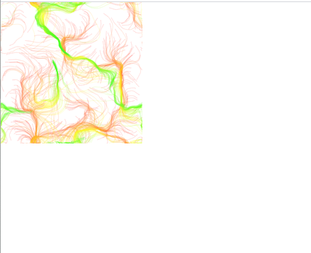
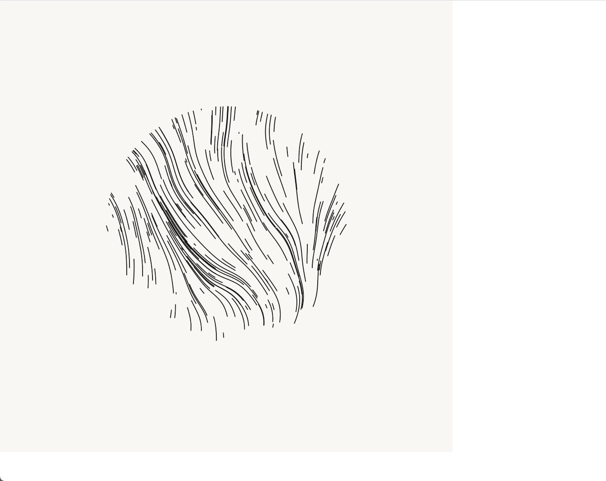
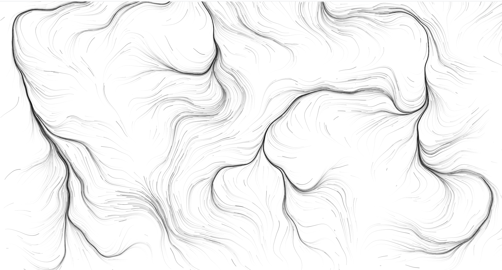	

### Week 3
Ben begonnen met de museum wand met radom schilderijen Van Gogh. Ik wilde hier eerst A-frame voor gebruiken. 
* Wat ging goed? - Het project kreeg zijn vorm de mogelijkheden die er waren binnen het framework wat ik gebruikten. 
* Wat kon beter? - Was deze week teveel bezig met de randzaken (zoals A-frame en het esthetisch). Wilde meer gaan coderen.

	

### Week 4
Deze week was er geen les ben verder gegaan met het coderen van de museumwand met een database te koppelen. Hievoor heb ik ook buffers in de code aangebracht. Zodat er geen fout output komt. 
* Wat ging goed? - Het project begon zijn huidige vorm te krijgen. Heb het voor elkaar gekregen dat niet twee dezelfde schilderijen te zijn waren. Ook heb ik de verschillden input mogelijkheden gecodeerd. 
* Wat kon beter? - Ik heb geen tijd gehad om aan de interactie te zitten. Hier had ik graag al een vorm in willlen hebben.

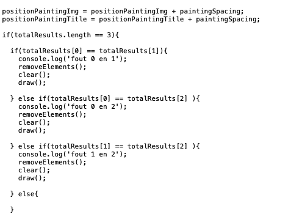
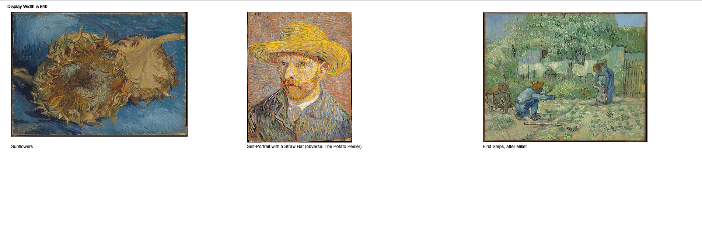

### Week 5
Deze week ben ik met de uistraling en de input van de gebruiker aan de slag gegaan. Tijdens de feedbacksessie kreeg ik positieve reacties op het concept en ontwerp en tips waar ik de interatie van de gebruiker kan toevoegen. 
* Wat ging goed? - Ik heb een orginele manier van interactie met de gebruiker gemaakt. Het werkte allemaal en ik heb de puntjes op de i gezet.
* Wat kon beter? - De overgang tussen de museumwand en het eigen gemaakte schilderij had wat beter kunnen zijn. Denk hierbij aan een transitie of een mooie overgang.

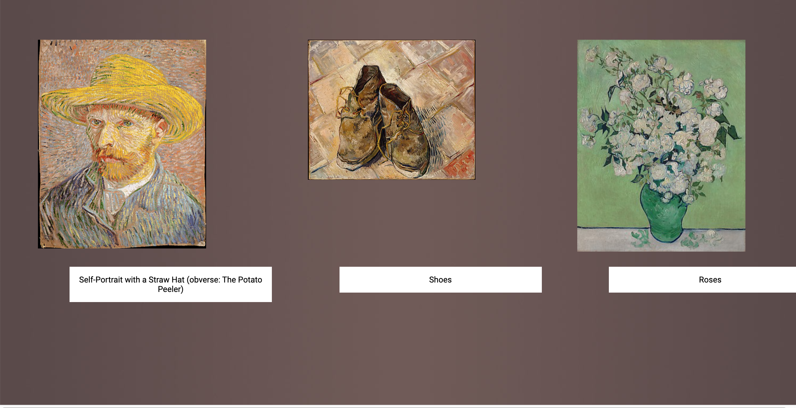

### Week 6
Deze week heb ik de laatste feedbacksessie gehad. Hieruit kwamen de laatste puntjes waarmee het project nog iets extra mee kreeg. Het ging hier om de volgende dingen: De uitstraling van een echt museum waarin de schilderijen hangen en de link tussen de schilderijen en het artwork. Het idee was om de prominente kleur uit het schilderij mee te geven aan het artwork. 

* Wat ging goed? - De uitstraling van een museum is nu goed naar voren gekomen. De schilderijen lijken nu echt of ze in een museum hangen. 
* Wat kon beter? - Het is mij helaas niet gelukt om de koppeling te maken tussen het gekozen schilderij en het artwork. Ik heb het geprobeerd met Color Thief. Hiermee wordt de prominente kleur uit een afbeelding gehaald. Deze extentie wilde in niet met de database die ik gebruikt om de schilderijen random op te vragen samenwerken. De database wordt op een manier aangestuurd dat niet met de extentie samen gaat. Heel spijtig :(. Daarna probeerde ik de twee verschillende pagina's met elkaar te comunniceren door de gegevens uit de afbeelding te koppelen aan kleuren in een switch. Dit lukt helaas ook niet. Als alternatief heb ik ervoor gekozen om een array te maken met de meest voorkomende kleurpalleten die van Gogh gebruikt in zijn kunstwerken.   

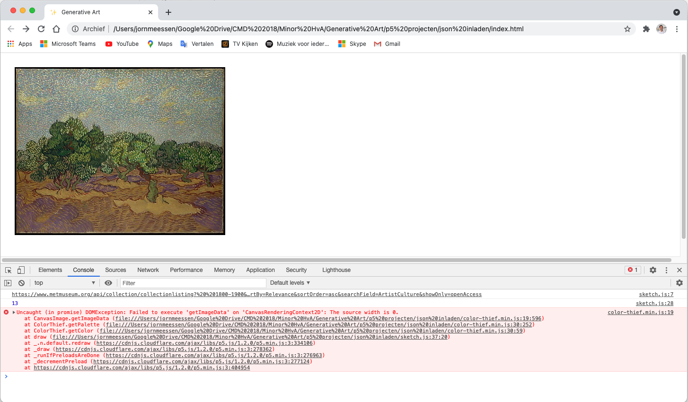
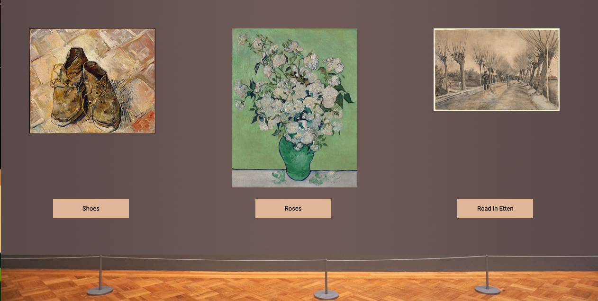
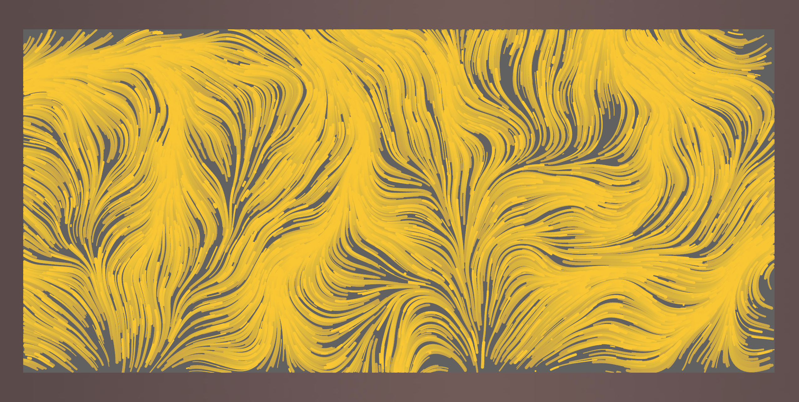

## Bronnenlijst

* https://www.youtube.com/watch?v=qtPi0JvmWbs&list=PLec2Yc8z8E2HzMGFO98nQoiGbwD2E7CL0&index=3
* https://github.com/CreativeCodeBerlin/creative-coding-minilist#im-an-artist
* https://www.notion.so/Noise-vector-flow-fields-38d438ae2b364c29aade753567ed216b
* http://www.generative-gestaltung.de/2/sketches/?02_M/M_1_5_02	
* https://www.metmuseum.org/api/collection/collectionlisting?%20%201800-1900&q=Vincent%20van%20gogh&perPage=20&offset=0&pageSize=0&sortBy=Relevance&sortOrder=asc&searchField=ArtistCulture&showOnly=openAccess
