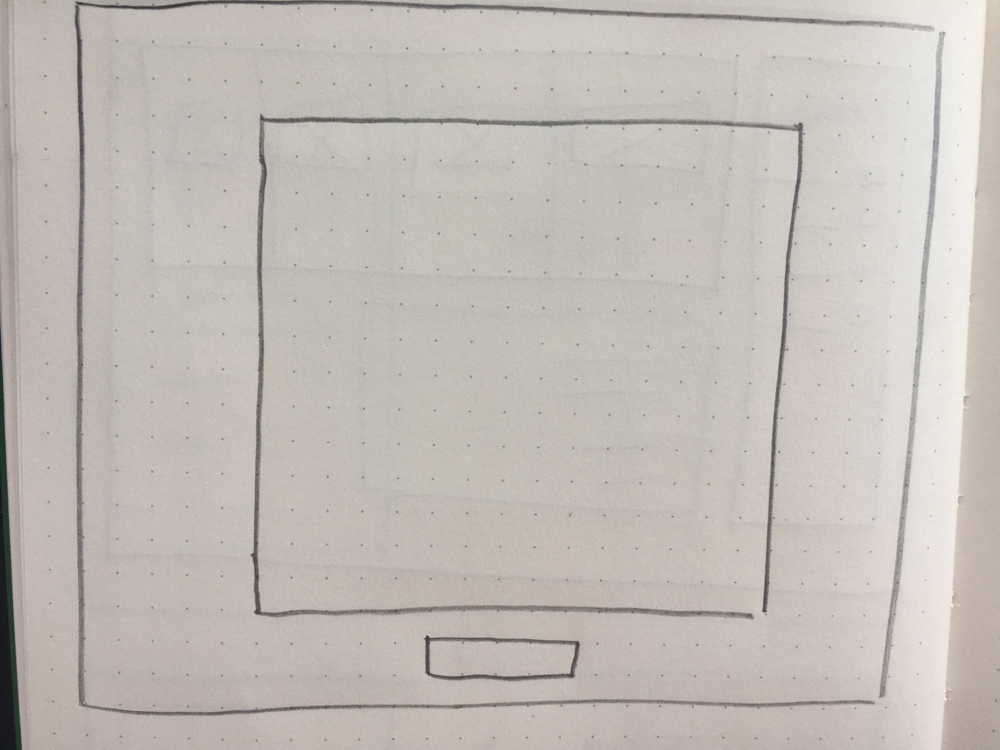
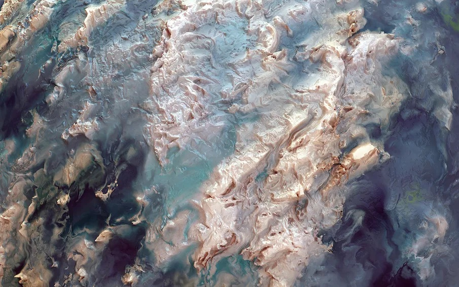

<!-- Vergeet je niet de comments uit te zetten voordat je begint met typen? 💬 -->

# Procesverslag

## Over
* **Naam:** Jorn Meessen 
* **Klas:** vid-2
* **Minor:** Visual Interface Design
* **Favoriete dier:** Panda's :panda_face:
* **Startniveau:** rood

## Concept

Letterlijk een digitaal kunstwerk. Met een witte paspartoe om het werk heen, net of het in een museum hangt.

Dit schilderij zal live gemaakt worden en als het 'af' is gaat het over in een nieuw werk. Er is altijd beweging in het beeld te zien binnen de kaders.  

<video width="400" controls>
  <source src="img/simplescreenrecorder-2021-01-10_04-56-11.mp4" type="img/simplescreenrecorder-2021-01-10_04-56-11.mp4">
  Your browser does not support HTML video.
</video>

Het schilderij wordt gemaakt uit ronden lijnen. Die lijken op de lijnen die van Gogh gebruikt in zijn werk. Er zullen meerderder lijnen tegelijk te zien zijn.

Wie ben ik, waar sta ik voor en wat wil ik:
-	Clean, netjes & geordend 
-	Uitdagend & creatief
-	Variatie 
-	Je moet betoverd worden

## Features

`Wat zijn de features in het project dat je gemaakt hebt? Waar kan ik op klikken? Waar zit de interactie?`

## Onderzoek & inspiratie
`Schrijf wat over je onderzoek en je inspiratie voor het project. Hoe kwam je concept tot stand?`

## Voortang

`Schrijf hier een klein logboekje met je voortgang per week.`

### Week-1
`Wat heb je gedaan? Wat ging goed? Wat kon beter?`

### Week-2
`Wat heb je gedaan? Wat ging goed? Wat kon beter?`

### Week-3
`Wat heb je gedaan? Wat ging goed? Wat kon beter?`

## Bronnenlijst

* `Link naar bron 1`
* `Link naar bron 2`
* `Link naar bron 3`